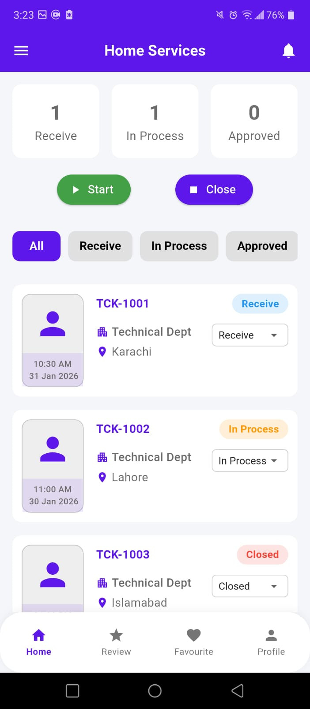
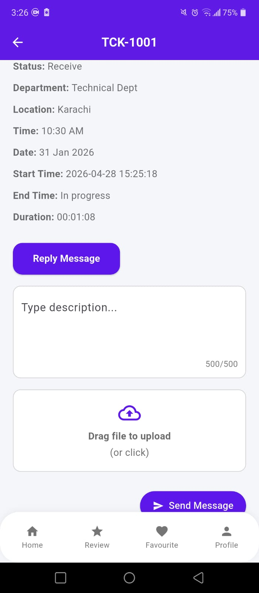

# 🚀 Radius Employee

A Flutter-based employee management app with Firebase integration, 
real-time push notifications, and cross-platform support for Android & iOS.

## 📱 Features

- 🔔 Real-time Push Notifications (Firebase)
- 👥 Employee Management System
- 🔐 Firebase Authentication
- 🌐 Cross-platform (Android & iOS)
- ⚡ High-performance & clean UI

## 🛠️ Tech Stack

| Technology | Purpose |
|-----------|---------|
| Flutter | Frontend UI |
| Dart | Programming Language |
| Firebase | Backend & Auth |
| REST APIs | Data Integration |
| SQLite | Local Storage |

## 📸 Screenshots

<!-- Add your screenshots here -->

<p align="center">
  
  
</p>


## 🚀 Getting Started

```bash
git clone https://github.com/mehranappdeveloper-create/radius_employee
cd radius_employee
flutter pub get
flutter run
```

## 👨‍💻 Developer

**Mehran Hanif** — Flutter App Developer
- LinkedIn: [Mehran Hanif](https://www.linkedin.com/in/mehran-hanif-3b7680285/)
- GitHub: [@mehranappdeveloper-create](https://github.com/mehranappdeveloper-create)
